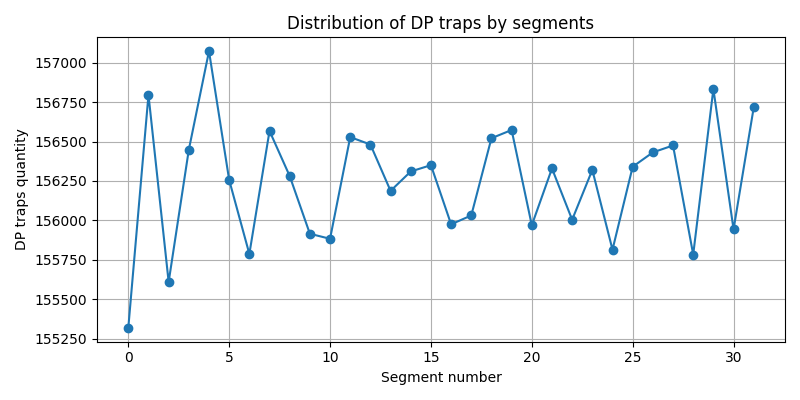
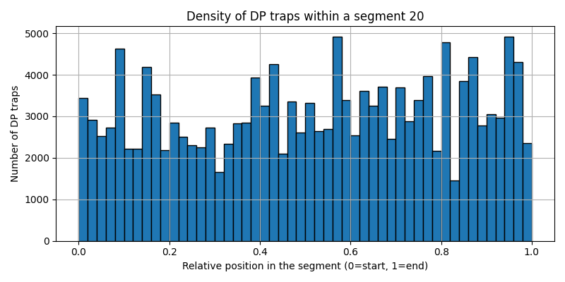

# 🦘 Pollard-Kangaroo Solver (Mark1)

**Mark1** is a high-performance, parallelized Pollard's Kangaroo algorithm implementation for solving ECDLP (Elliptic Curve Discrete Logarithm Problem) on the secp256k1 curve. It features wrap-aware kangaroos, configurable jump sizes, live statistics, loop detection, and restart counters.

# 🤝 Acknowledgements
Based on the original Pollard's Kangaroo algorithm
Uses SECP256K1 implementation from JeanLucPons/VanitySearch
Inspired by various cryptographic research papers

## 🔥 Key Features

- **Optimized AVX2 Implementation**: Leverages modern CPU instructions for maximum performance
- **Parallel Processing**: Utilizes OpenMP for multi-threaded execution
- **Smart Kangaroo Management**:
  - Configurable jump table size (`--k` parameter)
  - Wrap-around detection for out-of-range kangaroos
  - Brent's loop detection algorithm
  - Restart counters for stuck kangaroos
- **Efficient DP Storage**:
  - Compact representation of distinguished points
  - SIMD-accelerated Bloom filter for quick lookups
  - Configurable DP bits (`--dp_bits`)
- **Live Statistics**: Real-time monitoring of hops, speed, and restarts
- **Range Support**: Solves for arbitrary ranges (`--range` parameter)
- **Result Verification**: Automatically verifies found private keys

## Required Parameters:
**--range START:END**: Range to search (decimal or hex with 0x prefix)  
**--pubkey PUBKEY**: Target public key (compressed or uncompressed)  

## Optional Parameters:
**--dp_point N**: Number of distinguished points to generate (auto-calculated if omitted)  
**--dp_bits N**: Distinguished point mask bits (default: 12)  
**--k N**: Jump table size (default: range_bits/2)  
**--ram N**: RAM limit in GB (default: 16)  
**--save-dp**: Save distinguished points to DP.bin  
**--load-dp**: Load distinguished points from DP.bin. You can skip Phase1 

## 📊 Performance

Example performance on modern CPUs:

| CPU Model           | Threads | Speed (Hops/s) |
|---------------------|---------|----------------|
| Ryzen 9 7945HX      | 32      | ~160 MH/s      |
| Ryzen 7 5800H       | 16      | ~65 MH/s       |

## 🔷 Example Output
Below is an example of Mark1 in action, solving a Satoshi puzzle:  

**55 bits**  
```bash
./Mark1 --range 18014398509481983:36028797018963967  --pubkey 0385a30d8413af4f8f9e6312400f2d194fe14f02e719b24c3f83bf1fd233a8f963 --dp_point 500000 --dp_bits 10 --ram 32 

=========== Phase-0: RAM summary ===========
DP table : 26.1Mb  ( 500000 / 666667 slots, load 75.00% )
Bloom    : 977Kb
--------------------------------------------
Total    : 27.0Mb

========== Phase-1: Building traps =========
Unique traps: 500000/500000 (done)

=========== Phase-2: Kangaroos =============
Speed: 35.91 MH/s | Hops: 179568640 | Restart wild: 0 | Time: 0:0:5

============= Phase-3: Result ==============
Private key : 0x000000000000000000000000000000000000000000000000006ABE1F9B67E114
Found by thr: 17
Wild wraps  : 0  [no wrap]
Wild restart: 0
Total time  : 00:00:01.190
Private key : saved to FOUND.txt
```
**60 bits**  
```bash
./Mark1 --range 576460752303423487:1152921504606846975  --pubkey 0348e843dc5b1bd246e6309b4924b81543d02b16c8083df973a89ce2c7eb89a10d --dp_point 600000 --dp_bits 8 --ram 32 

=========== Phase-0: RAM summary ===========
DP table : 31.3Mb  ( 600000 / 800000 slots, load 75.00% )
Bloom    : 1.14Mb
--------------------------------------------
Total    : 32.4Mb

========== Phase-1: Building traps =========
Unique traps: 600000/600000 (done)

=========== Phase-2: Kangaroos =============
Speed: 126.51 MH/s | Hops: 632553472 | Restart wild: 0 | Time: 0:0:5

============= Phase-3: Result ==============
Private key : 0x0000000000000000000000000000000000000000000000000FC07A1825367BBE
Found by thr: 3
Wild wraps  : 0  [no wrap]
Wild restart: 0
Total time  : 00:00:04.096
Private key : saved to FOUND.txt
```
**75 bits**
```bash
./Mark1 --range 18889465931478580854783:37778931862957161709567  --pubkey 03726b574f193e374686d8e12bc6e4142adeb06770e0a2856f5e4ad89f66044755 --dp_point 200000000 --dp_bits 8 --ram 32

=========== Phase-0: RAM summary ===========
DP table : 10.2Gb  ( 200000000 / 268435456 slots, load 74.51% )
Bloom    : 381Mb
--------------------------------------------
Total    : 10.6Gb

========== Phase-1: Building traps =========
Unique traps: 200000000/200000000 (done)

=========== Phase-2: Kangaroos =============
Speed: 109.95 MH/s | Hops: 133433945344 | Restart wild: 0 | Time: 0:14:05

============= Phase-3: Result ==============
Private key : 0x0000000000000000000000000000000000000000000004C5CE114686A1336E07
Found by thread: 12
Wild wraps  : 0  [no wrap]
Wild restart: 0
Total time  : 00:14:06.325
Private key saved to FOUND.txt
```
**80 bits**  
```bash
./Mark1 --range 604462909807314587353087:1208925819614629174706175  --pubkey 037e1238f7b1ce757df94faa9a2eb261bf0aeb9f84dbf81212104e78931c2a19dc --dp_point 500000000 --dp_bits 12 --ram 32

=========== Phase-0: RAM summary ===========
DP table : 25.5Gb  ( 500000000 / 666666667 slots, load 75.00% )
Bloom    : 954Mb
--------------------------------------------
Total    : 26.4Gb

========== Phase-1: Building traps =========
Unique traps: 500000000/500000000 (done)

=========== Phase-2: Kangaroos =============
Speed: 103.94 MH/s | Hops: 364681496320 | Restart wild: 0 | Time: 0:38:10

============= Phase-3: Result ==============
Private key : 0x00000000000000000000000000000000000000000000EA1A5C66DCC11B5AD180
Found by thread: 6
Wild wraps  : 0  [no wrap]
Wild restart: 0
Private key saved to FOUND.txt
```

## 🔦 DP quality

The example is given for a range of 55 bits, 32 processor threads and 500000 traps.



## 🔎 DP analyzer

Added a little utility for analyzing DP traps. 
Example:
```bash
./DP-analyzer --segments 32 --range 18014398509481983:36028797018963967 --dp-file DP.bin
```
Output below
```bash
root@ubuntu:/home/ubuntu/Mark1# ./DP-analyzer --segments 32 --range 18014398509481983:36028797018963967 --dp-file DP.bin

DP traps distribution over 32 segments:

    Seg |     Count |     %tot  | bits |    minGap |    p10Gap |    medGap |    p90Gap |    avgGap |    maxGap    |     density | k_rec |    skew
-------------------------------------------------------------------------------------------------------------------------------------------------
      0 |    155318 |     3.11% |   50 |         2 | 286335376 |2041413870 |8085569486 |3623099368 |3552218984021 |    0.000000 |    15 |979.436534
      1 |    156796 |     3.14% |   50 |         2 | 266774533 |1931183793 |7883611228 |3590341941 |4399117378806 |    0.000000 |    15 |1224.264182
      2 |    155609 |     3.11% |   50 |         2 | 283131936 |1990537296 |7906291154 |3617709244 |4000365272898 |    0.000000 |    15 |1104.773019
      3 |    156448 |     3.13% |   50 |         2 | 280172024 |1999201034 |7955045112 |3598274225 |5401529215151 |    0.000000 |    15 |1500.144404
      4 |    157073 |     3.14% |   50 |         2 | 281980083 |2005302274 |7973237048 |3583946403 |3804280200361 |    0.000000 |    15 |1060.477984
      5 |    156256 |     3.13% |   50 |         2 | 277359734 |1988458088 |7903342526 |3600276614 |3258375964972 |    0.000000 |    15 |904.034895
      6 |    155787 |     3.12% |   50 |         2 | 278801873 |2005488092 |7952784062 |3601435538 |4232977379595 |    0.000000 |    15 |1174.358364
      7 |    156567 |     3.13% |   50 |         2 | 270949436 |1949770794 |7802611769 |3595552606 |4947136280444 |    0.000000 |    15 |1374.904297
      8 |    156281 |     3.13% |   50 |         2 | 278083606 |2003415064 |7998123974 |3602078945 |4628010601319 |    0.000000 |    15 |1283.816539
      9 |    155915 |     3.12% |   50 |         2 | 274125618 |1945121589 |7852976100 |3610616291 |4159899322423 |    0.000000 |    15 |1151.129994
     10 |    155883 |     3.12% |   50 |         2 | 279524569 |1987651282 |7871576928 |3611356782 |4693611330708 |    0.000000 |    15 |1298.680872
     11 |    156528 |     3.13% |   50 |         2 | 271361466 |1968998187 |7883254958 |3596483266 |4696727578309 |    0.000000 |    15 |1304.922267
     12 |    156481 |     3.13% |   50 |         2 | 273464370 |1965471699 |7780065510 |3597563569 |4284650639922 |    0.000000 |    15 |1189.986777
     13 |    156187 |     3.12% |   50 |         2 | 276673633 |2005537281 |7925947878 |3604354303 |4901598490295 |    0.000000 |    15 |1358.910286
     14 |    156310 |     3.13% |   50 |         2 | 277530934 |1998481292 |7900271938 |3601452747 |4683570121239 |    0.000000 |    15 |1299.466909
     15 |    156350 |     3.13% |   50 |         2 | 285419591 |2009611626 |7897409630 |3600520356 |3215995680395 |    0.000000 |    15 |892.203027
     16 |    155975 |     3.12% |   50 |         2 | 281152998 |2015756288 |8052479864 |3609225694 |2890969052050 |    0.000000 |    15 |799.994257
     17 |    156031 |     3.12% |   50 |         2 | 277374484 |1995540443 |7886524837 |3607952486 |4777993680880 |    0.000000 |    15 |1323.295068
     18 |    156521 |     3.13% |   50 |         2 | 283481766 |1996747242 |7916935052 |3596639316 |7571021838220 |    0.000000 |    15 |2104.026714
     19 |    156573 |     3.13% |   50 |         2 | 275178276 |1965786740 |7804236786 |3595406356 |4832049039431 |    0.000000 |    15 |1342.950742
     20 |    155969 |     3.12% |   50 |         2 | 288375244 |2013886639 |8073247333 |3609002012 |4266529273273 |    0.000000 |    15 |1181.190883
     21 |    156329 |     3.13% |   50 |         2 | 274246703 |1975993583 |7995808487 |3601043691 |2667023143930 |    0.000000 |    15 |739.625045
     22 |    156004 |     3.12% |   50 |         2 | 286017612 |2012492985 |8098438698 |3608512336 |4574693881646 |    0.000000 |    15 |1266.750657
     23 |    156320 |     3.13% |   50 |         2 | 293534665 |2077601990 |8104920033 |3601236410 |5457974825091 |    0.000000 |    15 |1514.583596
     24 |    155814 |     3.12% |   50 |         2 | 266874628 |1928124778 |7843863288 |3612965012 |4798497317200 |    0.000000 |    15 |1327.132795
     25 |    156340 |     3.13% |   50 |         2 | 279685957 |1986149024 |7864819970 |3600785268 |3723418006343 |    0.000000 |    15 |1033.057221
     26 |    156431 |     3.13% |   50 |         2 | 271927490 |1948407910 |7804697457 |3598703513 |4434011671808 |    0.000000 |    15 |1231.113637
     27 |    156475 |     3.13% |   50 |         2 | 275642613 |1963488087 |7936075680 |3597702173 |4435852977078 |    0.000000 |    15 |1231.968369
     28 |    155783 |     3.12% |   50 |         2 | 272438208 |1973809063 |7964625118 |3613679903 |3462464465466 |    0.000000 |    15 |957.154723
     29 |    156833 |     3.14% |   50 |         2 | 286945505 |2026290252 |8056189891 |3589481788 |4220043502566 |    0.000000 |    15 |1174.669290
     30 |    155943 |     3.12% |   50 |         2 | 272663138 |1958078456 |7778688670 |3609979876 |5436255377986 |    0.000000 |    15 |1504.896312
     31 |    156716 |     3.13% |   50 |         2 | 274699741 |1972006372 |7855666186 |3592149293 |6174146753199 |    0.000000 |    15 |1717.789018

Empty segments: 0   Min/Max/Mean/Var count: 155318/157073/156245.19/143979.21

```
## 🛠️ Building

Requirements:
- Ubuntu Linux or WSL2 for Windows  
- GCC 9+ or Clang 10+
- OpenMP support
- AVX2 capable CPU

```bash
git clone https://github.com/yourusername/Mark1.git
cd Mark1
**Mark1 compiling**
g++ Mark1.cpp Int.cpp SECP256K1.cpp Point.cpp Random.cpp IntMod.cpp IntGroup.cpp Timer.cpp -O3 -march=native -funroll-loops -ftree-vectorize -fstrict-aliasing -fno-semantic-interposition -fvect-cost-model=unlimited -fno-trapping-math -fipa-ra -fipa-modref -flto -fassociative-math -fopenmp -mavx2 -mbmi2 -madx -std=c++17 -fopenmp -pthread -o Mark1
**DP-analyzer compiling**
g++ DP-analyzer.cpp Int.cpp -O3 -march=native -funroll-loops -ftree-vectorize -fstrict-aliasing -fno-semantic-interposition -fvect-cost-model=unlimited -fno-trapping-math -fipa-ra -fipa-modref -flto -fassociative-math -fopenmp -mavx2 -mbmi2 -madx -std=c++17 -fopenmp -pthread -o DP-analyzer

```

## 🚧**VERSIONS**
**V1.3**: Full SSD rework: double hashing, MAX_LOAD=0.5, bloom filter size increasing (10 bit), batched inserting/checking, MADV_SEQUENTIAL. Thanks OpenAI for ChatGPT helping to solve these problems. This is amazing!  
**V1.2**: SSD rework. Dp table storing on SSD, instead of RAM. A few security updates and speed increasing.  
**V1.1**: Added save and load distinguished points (DP) from file (DP.bin). This feature was coded by NoMachine.  
**V1.0**: Release

## ✌️TIPS
BTC: bc1qtq4y9l9ajeyxq05ynq09z8p52xdmk4hqky9c8n
